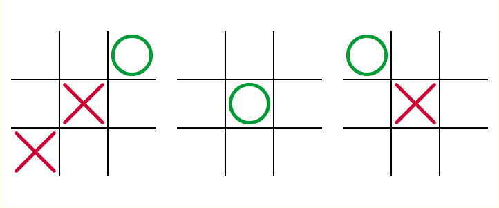
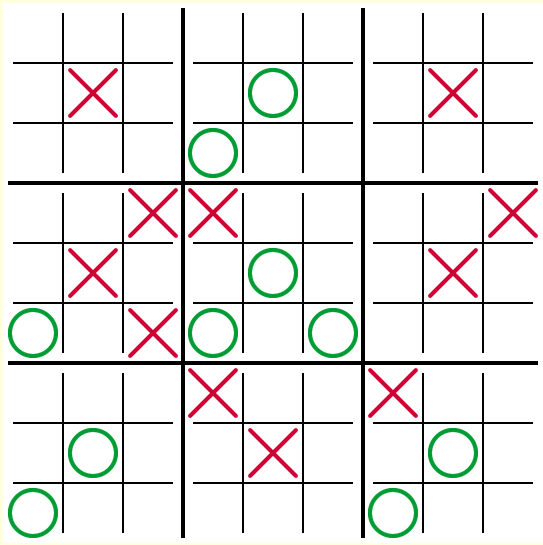
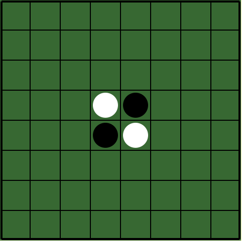
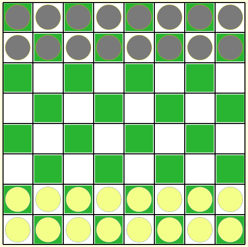

# Gamesite

A Go-based game server that hosts a collection of simple turn-based web games. It is designed with flexibility in mind, allowing for easy registration and addition of new games.

### Games Implemented (so far)

* #### Three Tic Tac Toe
  

* #### Nested Tic Tac Toe
  

* #### Reversi
  

* #### Pawns only Chess
  

* #### [Maxit](https://play.google.com/store/apps/details?id=com.loonybot.maxitmonkey&gl=US)


### Idea

Players can select a game, create a room, and share the room's URL with a friend to play. Rooms are automatically closed under the following conditions:
- The game reaches an end state.
- The other player fails to join within the time limit.
- A player fails to make a move within the time limit (adjustable).


#### To build


```bash
make build
```

The above command generates a single binary using [stuffbin](https://github.com/knadh/stuffbin), bundling all HTML files and images.

#### To run

```bash
make run
```

The application listens on port ```8080```.

#### Architecture
The application consists of 3 components

* Web: Handles REST and WebSocket handlers.
* Room: An in-memory data structure that manages game states, including making moves, tracking players, and determining game outcomes.
* Hub: Responsible for managing rooms (creation and destruction).

#### Example Deployment

To scale horizontally, we deploy multiple game‑server instances. Since each room is an in‑memory object holding the game state, all players for a given room must hit the same server. We solve this in HAProxy with a small Lua script: on each request HAProxy extracts the ```room_id``` from the path, looks up its server in Redis, and then routes the client to the correct backend.

```mermaid
graph LR
    subgraph Client
      A[User A] 
      B[User B]
    end

    subgraph Edge
      HA[HAProxy\n(custom Lua)]
    end

    subgraph Backends
      G1[Game Server 1]
      G2[Game Server 2]
      G3[Game Server 3]
      R[Redis/Valkeyrie]
    end

    A --> HA
    B --> HA
    HA --> G1
    HA --> G2
    HA --> G3
    HA --> R
```
##### Flow
1) Room Creation: User A sends GET `/gamesite/create/{gametype}` to HAProxy. HAProxy proxies the request to a random game server (e.g., Game Server 2). Game Server 2 creates a new room in its in‑memory and stores a mapping ```room:{ID} → app2``` into Redis.

2) Subsequent Joins: User B (or any invitee) visits `/gamesite/rooms/{roomID}` or `/gamesite/rooms/{roomID}/ws`. The Lua action extracts `{roomID}` from the path, queries Redis (`room:{roomID}`), retrieves the associated server (e.g., app2), and routes the request to that server.

3) WebSocker Upgrade: For ```/ws```, same lookup logic applies, HAproxy ensures the upgrade handshake and all traffic go to the correct game server holding the room.
